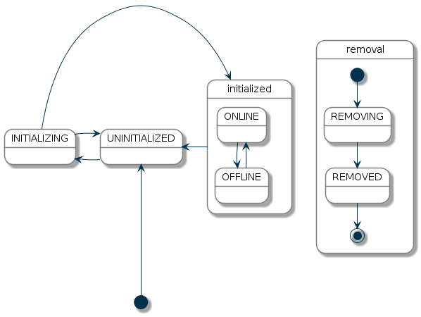

# Thing Status

Each thing has a status object, which helps to identify possible problems with the device or service. The following table provides an overview of the different statuses:

| Status        | Description |
|---------------|-------------|
| UNINITIALIZED | This is the initial status of a thing, when it is added or the framework is being started. This status is also assigned, if the initializing process failed or the binding is not available. Commands, which are sent to channels will not be processed.
| INITIALIZING  | This state is assigned while the binding initializes the thing. It depends on the binding how long the initializing process takes. Commands, which are sent to channels will not be processed.
| ONLINE        | The device/service represented by a thing is assumed to be working correctly and can process commands.
| OFFLINE       | The device/service represented by a thing is assumed to be not working correctly and may not process commands. But the framework is allowed to send commands, because some radio-based devices may go back to ONLINE, if a command is send to them. 
| REMOVING      | The device/service represented by a thing should be removed, but the binding did not confirm the deletion yet. Some bindings need to communicate with the device to unpair it from the system. Thing is probably not working and commands can not be processed.
| REMOVED       | This status indicates, that the device/service represented by a thing was removed from the external system. Usually this status is an intermediate status, because the thing is removed from the database after this status is assigned.

The statuses UNINITIALIZED, INITIALIZING and REMOVING are set by the framework, where as the statuses ONLINE, OFFLINE and REMOVED is assigned from a binding.

## Status Transitions

The following diagram shows the allowed status transitions:



The initial state of a thing is UNINITIALIZED. From UNINITIALIZED the thing goes into INITIALIZING. If the initialization fails, the thing goes back to UNINITIALIZED. If the initialization succeeds, the binding sets the status of the thing to ONLINE or OFFLINE, which both means, that the thing is INITIALIZED. From one of this states the thing can go back into UNINITIALIZED, REMOVING or REMOVED. The status REMOVING and REMOVED can also be reached from any other state. 

## Status Details

A status is detailed further with a status detail object. The following table lists the different status details:

| Status Detail              | Description | 
|----------------------------|-------------| 
| NONE                       | No further status details available. |
| HANDLER_MISSING_ERROR      | The handler cannot be initialized, because the responsible binding is not available or started. | 
| HANDLER_INITIALIZING_ERROR | The handler failed in the initialization phase. |
| CONFIGURATION_PENDING      | The thing is waiting to transfer configuration information to a device. Some bindings need to communicate with the device to make sure the configuration is accepted. | 
| COMMUNICATION_ERROR        | Error in communication with the device. This may also be only a temporary error. |
| CONFIGURATION_ERROR        | An issue with the configuration of a thing prevents the communication with the represented device or service. This issue might be solved by reconfiguring the thing. | 
| BRIDGE_OFFLINE             | Assuming the thing to be offline because the corresponding bridge is offline. | 
| FIRMWARE_UPDATING          | The thing operates currently a firmware update. | 
| DUTY_CYCLE                 | The thing is currently in DUTY_CYCLE state, which means it is blocked for further usage. | 

### Status Detail Mapping

Statuses can only have some of the given details. The allowed combinations are listed in the following table:

| Status        | Status Details |
|---------------|----------------|
| UNINITIALIZED | NONE<br>HANDLER_MISSING_ERROR<br>HANDLER_INITIALIZING_ERROR |
| INITIALIZING  | NONE |
| ONLINE        | NONE<br>CONFIGURATION_PENDING | 
| OFFLINE       | NONE<br>COMMUNICATION_ERROR<br>CONFIGURATION_ERROR<br>BRIDGE_OFFLINE<br>FIRMWARE_UPDATING<br>DUTY_CYCLE | 
| REMOVING      | NONE | 
| REMOVED       | NONE | 

## Status Description 

To provide additional information about the current status a description is used. The status description is be specified by the binding. This description can be used for debugging purposes and should not be presented to the user, as it might contain unreadable technical information (e.g. an HTTP status code, or any other protocol specific information, which helps to identify the current problem).

## Thing Status API

The Thing interface defines a method `getStatusInfo()` to retrieve the current status of the thing. The following code shows how to print the status of each thing into the console:

```java
Collection<Thing> things = thingRegistry.getAll();
for (Thing thing : things) {
    ThingStatusInfo statusInfo = thing.getStatusInfo();
    switch (statusInfo.getStatus()) {
        case ONLINE:
            System.out.println("Thing is online");
            break;
        case OFFLINE:
            System.out.println("Thing is offline");
            break;
        default:
            System.out.println("Thing is in state " + statusInfo.getStatus());
            break;
    }
    System.out.println("Thing status detail: " + statusInfo.getStatusDetail());
    System.out.println("Thing status description: " + statusInfo.getDescription());
}
```
